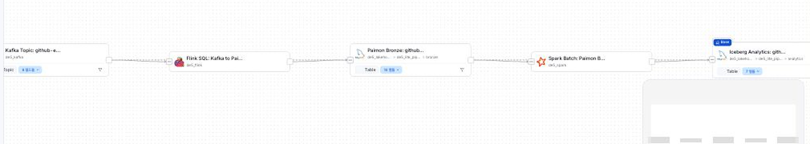

# OpenMetadata 리니지 확인 리소스

이 자료는 OpenMetadata를 각자 노트북에 설치하기 위한 실습이 아닙니다. 수업에서 만든 커머스 데이터 파이프라인을 데이터 카탈로그와 리니지 관점으로 어떻게 읽는지 확인하기 위한 참고 자료입니다.

OpenMetadata는 Docker 리소스를 많이 사용하므로 학생 필수 실습 범위에는 포함하지 않습니다. 수업에서는 멘토가 준비한 화면 또는 캡처를 기준으로 함께 확인합니다.

## 왜 보는가

데이터 파이프라인은 실행되는 것만으로 충분하지 않습니다. 운영 환경에서는 아래 질문에 답할 수 있어야 합니다.

- 이 테이블은 어떤 원천 데이터에서 왔는가?
- 어떤 파이프라인이 이 테이블을 만들었는가?
- 이 테이블이 깨지면 어떤 downstream 지표와 BI가 영향을 받는가?
- 컬럼의 의미와 소유자는 어디에 기록되어 있는가?

OpenMetadata 같은 데이터 카탈로그 도구는 이런 정보를 한곳에 모아 관리합니다.

## 우리가 확인할 리니지

```text
Kafka Topic: commerce-events
  -> Flink Pipeline: commerce_events_bronze_ingestion
  -> Paimon Bronze: commerce_events_bronze
  -> Spark Pipeline: commerce_events_iceberg_transform
  -> Iceberg Analytics: commerce_events_clean
  -> Iceberg Analytics: commerce_event_type_daily
  -> Iceberg Analytics: commerce_category_daily
  -> BI Dashboard
```

## 캡처



## 확인할 포인트

1. 원천은 무엇인가?
2. 중간 저장 계층은 무엇인가?
3. 기준 분석 테이블은 무엇인가?
4. 어떤 파이프라인이 데이터를 만들었는가?
5. 장애가 나면 영향 범위는 어디까지인가?

## 수업에서의 위치

- 1-2차시: 전체 파이프라인 지도와 실행 환경을 이해합니다.
- 3-5차시: Kafka, Flink/Paimon, Spark/Iceberg를 구현합니다.
- 6차시 이후: 장애 대응, 로그, 재처리, 모니터링, 리니지 기반 영향 분석을 더 깊게 다룹니다.

OpenMetadata는 초반에 "이런 관점으로 보게 된다"는 청사진으로 보고, 실제 운영 관점은 뒤 차시에서 점점 강화합니다.
