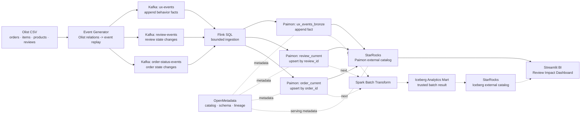

# DE5 Commerce Lakehouse 프로젝트 시나리오

이 문서는 3차시/4차시 수업자료를 Claude에게 검토시킬 때 공유하기 위한 기준 설명입니다.

## 핵심 요약

Olist 공개 이커머스 데이터의 주문, 상품, 리뷰 실데이터를 기반으로 수업용 UX 행동 로그를 생성하고, `Kafka -> Flink -> Paimon -> StarRocks/BI` 흐름으로 운영성 지표를 확인합니다.

이후 `Spark -> Iceberg -> StarRocks/BI` 흐름으로 신뢰 가능한 배치 분석 지표까지 확장합니다.

핵심 메시지는 다음입니다.

> UXLog는 "사용자가 무엇을 했는가"를 append-only로 남기는 행동 이벤트이고, 리뷰와 주문 상태는 "현재 어떤 상태인가"를 유지해야 하는 current-state entity 데이터입니다.

## 데이터의 진짜/생성 경계

Olist 원본에는 주문, 주문 상품, 상품, 리뷰, 리뷰 점수, 주문 상태 타임스탬프가 있습니다.

하지만 Olist 원본에는 클릭스트림/UX 행동 로그가 없습니다.

그래서 `ux-events`는 Olist 원본 로그가 아니라, Olist의 주문, 상품, 리뷰 관계를 기반으로 생성한 수업용 행동 이벤트입니다.

예시 이벤트 타입:

- `search_result_click`
- `product_view`
- `review_impression`
- `review_expand`
- `add_to_cart`
- `remove_from_cart`
- `purchase`

주의:

> 여기서 `purchase`는 확정 매출이 아니라 "구매 행동 이벤트"입니다. 확정 주문 상태는 `order_current`에서 봅니다.

## 키 연결 방식

UX 이벤트는 완전히 독립적인 가짜 데이터가 아닙니다. Olist의 실제 관계를 바탕으로 생성합니다.

| 필드 | 의미 |
|---|---|
| `source_product_id` | Olist 원본 product_id |
| `product_id` | 수업용 deterministic surrogate key |
| `source_customer_id` | Olist 원본 customer_id |
| `user_id` | 수업용 deterministic surrogate user key |
| `order_id` | Olist 주문 ID |
| `source_review_id` | Olist 리뷰 ID |
| `catalog_id` | 상품 카테고리/분석용 묶음 키 |

즉, UX 이벤트는 Olist 상품, 주문, 리뷰와 조인 가능한 형태입니다.

## Topic과 테이블 설계

| Kafka Topic | 의미 | Paimon Table | 저장 모델 |
|---|---|---|---|
| `ux-events` | 사용자의 행동 로그 | `ux_events_bronze` | append-only fact |
| `review-events` | 리뷰 상태 변화 | `review_current` | upsert/current-state |
| `order-status-events` | 주문 상태 변화 | `order_current` | upsert/current-state |

## 왜 Paimon을 쓰는가

`ux-events`만 보면 append라서 Paimon 명분이 약해 보일 수 있습니다.

하지만 이번 프로젝트는 `review_current`, `order_current`처럼 current-state entity를 함께 다룹니다.

Paimon을 쓰는 이유:

- Flink와 잘 맞는 Lakehouse Bronze 계층입니다.
- append fact와 upsert current-state를 함께 설명하기 좋습니다.
- raw_json을 남겨 파싱/스키마 문제를 나중에 복구할 수 있습니다.
- 자동 compaction 등 운영 관점 설명이 가능합니다.
- StarRocks에서 Paimon external catalog로 조회할 수 있습니다.

## 전체 아키텍처

중요한 표현:

- StarRocks는 Kafka에서 직접 받는 구조가 아닙니다.
- StarRocks는 OLAP serving/query layer입니다.
- 현재 BI는 StarRocks external catalog를 통해 Paimon/Iceberg 테이블을 조회합니다.
- OpenMetadata는 데이터 처리 경로가 아니라 메타데이터/리니지 관찰 계층입니다.

## Claude 검토 요청 포인트

1. 학생이 `ux-events`를 Olist 원본 클릭스트림으로 오해하지 않도록 설명이 충분한가?
2. "Olist 실데이터"와 "생성한 UXLog"의 경계가 명확한가?
3. append fact와 current-state entity의 차이가 자연스럽게 전달되는가?
4. Paimon을 쓰는 이유가 `ux-events` append만이 아니라 `review_current`, `order_current` upsert까지 포함해 설득되는가?
5. StarRocks가 Kafka 직접 적재가 아니라 Paimon/Iceberg external catalog 기반 OLAP serving layer로 설명되는가?
6. 3차시와 4차시가 각각 다른 날 2시간 수업으로 분리되어 있는가?
7. 각 차시 과제가 실행 캡처가 아니라 검증 체인 중심으로 설계되어 있는가?
