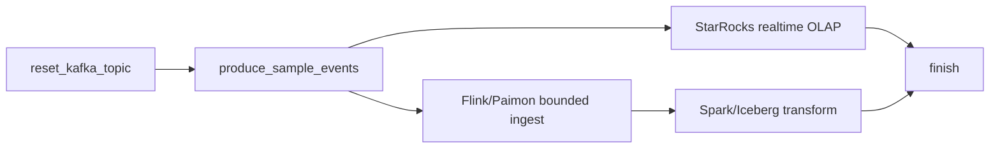

# 5차시 Airflow DAG 정리

## 한 줄 요약

이번 프로젝트의 Airflow DAG는 데이터를 직접 처리하는 도구가 아니라, 이미 구성된 파이프라인을 운영 관점에서 검증하고 배치 마트를 재생성하며 BI 지표까지 확인하는 오케스트레이션 계층입니다.

```text
Kafka -> Flink streaming -> Paimon
                         |
                         v
Airflow DAG: 검증 -> Spark/Iceberg mart 생성 -> StarRocks BI 지표 검증
```

Airflow가 하는 일은 "데이터를 처리한다"가 아니라 "정해진 순서로 실행하고, 어디에서 실패했는지 증거를 남긴다"입니다.

## DAG 파일 위치

```text
labs/06-airflow-orchestration/dags/de5_olist_project_mvp_pipeline.py
```

참고용 이전 DAG:

```text
labs/06-airflow-orchestration/dags/de5_lite_lakehouse_pipeline.py
```

## 이번 수업의 메인 DAG

```text
dag_id = de5_olist_project_mvp_pipeline
```

이 DAG는 Olist 기반 최종 프로젝트 MVP를 위한 DAG입니다.

중요한 전제:

- Kafka topic에는 이미 Olist 이벤트가 들어가 있어야 합니다.
- Flink streaming job 3개가 이미 `RUNNING` 상태여야 합니다.
- Paimon에는 streaming ingestion 결과가 쌓이고 있어야 합니다.
- Airflow는 Flink streaming job을 직접 시작하거나 끝내지 않습니다.

즉, Flink streaming job은 계속 떠 있는 수집 계층이고, Airflow는 그 상태를 확인한 뒤 배치/검증 단계를 오케스트레이션합니다.

## 전체 DAG 흐름


## task별 역할

| task | 역할 | 실패하면 먼저 볼 곳 |
|---|---|---|
| `validate_runtime_services` | Kafka, Flink, MinIO, Iceberg REST, StarRocks가 응답하는지 확인 | Docker container 상태, port, healthcheck |
| `validate_flink_streaming_jobs` | Flink UI에서 Olist streaming job 3개(`ingest-ux-events`, `ingest-review-current`, `ingest-order-current`)가 `RUNNING`인지 확인 | Flink UI, JobManager log, job submit 여부 |
| `validate_paimon_fresh` | Paimon table row count가 기대값과 맞는지 확인 | Paimon catalog, MinIO warehouse, Flink sink records |
| `reset_iceberg_tables` | Iceberg analytics table을 재생성하기 위해 기존 table 초기화 | Spark/Iceberg catalog 설정, Iceberg REST |
| `build_iceberg_analytics_mart` | Spark로 Paimon table을 읽어 Iceberg analytics mart 생성 | Spark log, Paimon read, Iceberg write |
| `query_iceberg_tables` | 생성된 Iceberg table count와 mart 결과 확인 | Iceberg table 존재 여부, Spark query |
| `validate_bi_metric_counts` | StarRocks Iceberg external catalog로 BI 핵심 지표 검증 | StarRocks catalog, 지표 정의, Iceberg table count |

## 왜 Flink job을 Airflow에서 직접 실행하지 않나?

Flink streaming job은 batch task처럼 끝나는 작업이 아닙니다.

```text
batch task
- 시작한다
- 처리한다
- 끝난다
- SUCCESS / FAILED로 판단한다

streaming job
- 시작한다
- 계속 구독한다
- 계속 처리한다
- RUNNING 상태 자체가 정상이다
```

그래서 이번 DAG에서 Airflow는 Flink job을 `SUCCESS`로 끝내는 방식이 아니라, 이미 떠 있는 streaming job이 살아 있는지 확인합니다.

수업에서 강조할 문장:

> Flink는 데이터를 계속 흘려보내는 수집 계층이고, Airflow는 그 위에서 "이제 배치 마트를 만들어도 되는 상태인가?"를 확인하는 운영 계층입니다.

## 기대 검증값

### Paimon

`validate_paimon_fresh` task log에서 확인할 값입니다.

```text
ux_events_bronze  16693
review_current     1971
order_current      2000
```

주의:

- `ux_events_bronze`는 append-only 행동 로그라 이벤트 수와 row count가 같습니다.
- `review_current`는 `review_id` 기준 current-state upsert table입니다.
- `order_current`는 `order_id` 기준 current-state upsert table입니다.

따라서 Kafka input count와 Paimon current table row count가 다르다고 바로 유실이라고 판단하면 안 됩니다.

```text
review-events        5943 events -> review_current 1971 rows
order-status-events  7886 events -> order_current  2000 rows
```

이 차이는 유실이 아니라, 같은 key의 상태 변경 이벤트가 current table에서 최신 상태 한 줄로 접힌 결과입니다.

### Iceberg Analytics

`query_iceberg_tables` task log에서 확인할 값입니다.

```text
olist_ux_events_clean                 16693
olist_review_current                   1971
olist_order_current                    2000
olist_event_type_daily                  256
olist_funnel_daily                       52
olist_category_daily                    759
olist_review_sentiment_by_category      120
```

### BI Metrics

`validate_bi_metric_counts` task는 StarRocks Iceberg external catalog로 아래 값을 검증합니다.

```text
total_events       16693
users               2875
sessions            2875
orders              1968
revenue        265036.00
reviews             1971
avg_rating          3.93
negative_reviews     367
order_current_rows  2000
```

주의:

- `users = sessions = 2875`는 이번 생성 UX 시나리오의 특성입니다. 운영 일반 규칙이 아닙니다.
- `orders = 1968`은 UX 이벤트 기준 purchase/order-linked BI 지표입니다.
- `order_current_rows = 2000`은 주문 엔티티 current-state table row count입니다.
- 두 숫자가 다른 이유는 "지표 정의가 다르기 때문"입니다.

## 이전 lite DAG와의 차이

이전 참고용 DAG:

```text
dag_id = de5_lite_lakehouse_pipeline
```

이 DAG는 초기 실습용으로, Kafka topic reset부터 sample event produce, StarRocks realtime load, Paimon bounded ingest, Spark/Iceberg transform까지 한 번에 묶은 구조였습니다.



이번 Olist MVP DAG는 다릅니다.

| 구분 | 이전 lite DAG | 새 Olist MVP DAG |
|---|---|---|
| 목적 | 한 사이클을 빠르게 보여주는 교육용 demo | 프로젝트 MVP 운영 검증 |
| Kafka produce | DAG 내부에서 수행 | DAG 이전에 준비됨 |
| Flink | bounded ingest 중심 | streaming job RUNNING 상태 검증 |
| Paimon | bronze 적재 확인 | bronze/current-state freshness 검증 |
| Iceberg | transform 실행 후 query | analytics mart 재생성 및 count 검증 |
| BI | 제한적 확인 | StarRocks external catalog로 BI metric 검증 |
| 핵심 메시지 | 전체 흐름 체험 | 운영 가능한 파이프라인 검증 |

## 수업에서 던질 질문

1. Airflow가 직접 처리하는 것과 처리하지 않는 것은 무엇인가요?
2. Flink streaming job은 왜 Airflow task처럼 끝나면 안 되나요?
3. `RUNNING job`은 무엇을 증명하고, `row count`는 무엇을 증명하나요?
4. Kafka count와 Paimon count가 다르면 바로 유실이라고 말해도 될까요?
5. BI metric 검증이 실패하면 Kafka, Flink, Paimon, Spark, Iceberg, StarRocks 중 어디부터 확인해야 할까요?

## 실패 시 확인 순서

```text
1. validate_runtime_services 실패
   -> Docker container / healthcheck / port 확인

2. validate_flink_streaming_jobs 실패
   -> Flink UI에서 job 3개 RUNNING 여부 확인

3. validate_paimon_fresh 실패
   -> Kafka에 데이터가 들어왔는지
   -> Flink sink records가 증가했는지
   -> MinIO Paimon warehouse에 파일이 생겼는지
   -> Paimon query count가 맞는지

4. build_iceberg_analytics_mart 실패
   -> Spark가 Paimon을 읽을 수 있는지
   -> Iceberg REST catalog에 쓸 수 있는지

5. validate_bi_metric_counts 실패
   -> 지표 정의 차이인지
   -> Iceberg table count 문제인지
   -> StarRocks external catalog 문제인지 분리
```

## 발표자 노트용 설명

이 장에서는 Airflow를 "또 하나의 데이터 처리 엔진"으로 설명하면 안 됩니다.

Kafka는 이벤트를 받고, Flink는 계속 처리하고, Paimon은 bronze/current-state를 저장하고, Spark는 batch mart를 만들고, Iceberg는 batch 기준 테이블을 저장합니다.

Airflow는 이 도구들을 대체하지 않습니다. 대신 "이 단계가 끝났는가?", "다음 단계를 실행해도 되는가?", "실패했다면 어느 task에서 실패했는가?", "재실행할 단위는 어디인가?"를 관리합니다.

그래서 이번 DAG의 첫 번째 task는 데이터를 처리하는 task가 아니라 runtime service 검증입니다. 두 번째도 Flink job 실행이 아니라 Flink streaming job이 살아 있는지 확인하는 task입니다.

이 설계가 실무적으로 중요한 이유는, 운영에서는 "전체가 안 됩니다"라는 말보다 "Flink job은 RUNNING인데 Paimon freshness 검증에서 실패했습니다"처럼 실패 지점을 좁히는 것이 훨씬 중요하기 때문입니다.
